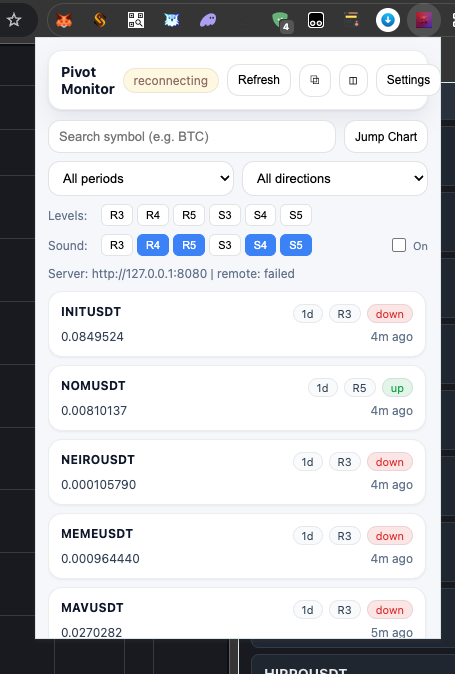
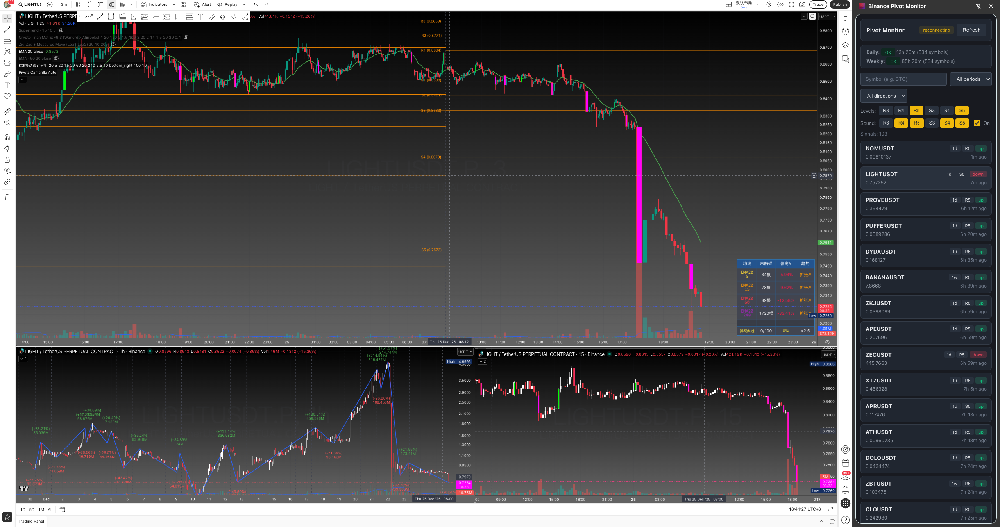
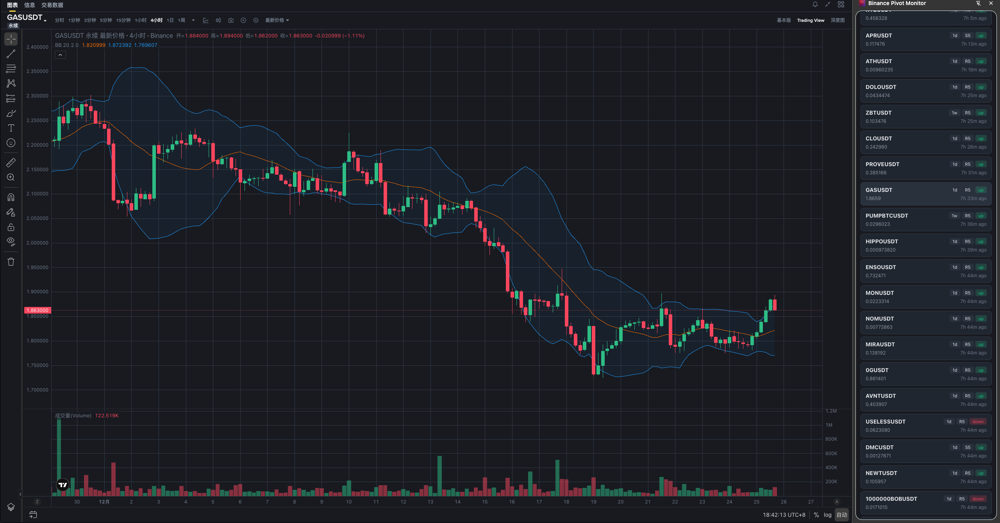
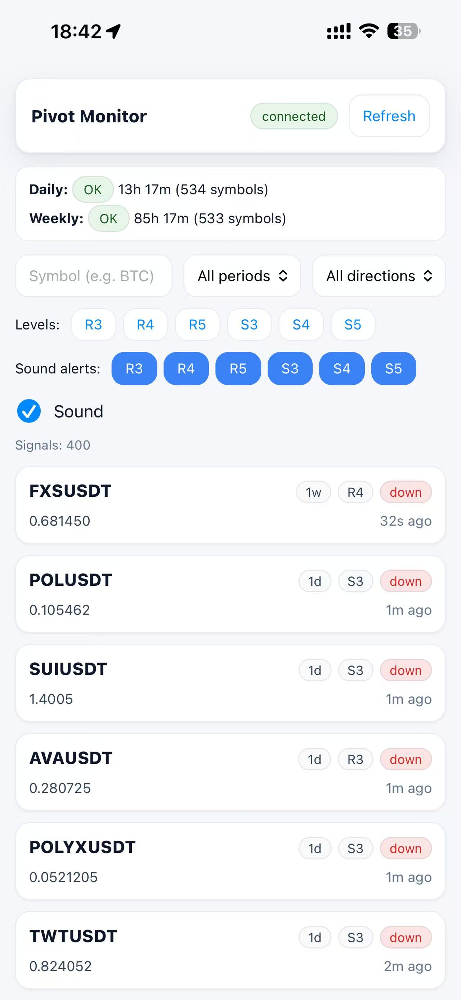

# Binance Pivot Monitor

[English](#english) | [中文](#中文)

---

## Screenshots / 截图预览

| Web Dashboard | Side Panel + TradingView |
|:---:|:---:|
|  |  |

| Side Panel + Binance | iOS PWA |
|:---:|:---:|
|  |  |

---

## English

### Overview

Binance Pivot Monitor is a real-time cryptocurrency pivot point monitoring system for Binance USDT perpetual futures. It calculates Camarilla pivot levels and sends alerts when prices cross key support/resistance levels. It also supports K-line candlestick pattern recognition and correlates pattern signals with pivot alerts.

### Features

- **Real-time Monitoring**: WebSocket connection to Binance for live mark price updates
- **Real-time Ticker Data**: 24h price change, volume, and trade count via `!ticker@arr` stream
- **Camarilla Pivot Points**: Automatic calculation of R3-R5 and S3-S5 levels
- **Daily & Weekly Pivots**: Support for both timeframes with automatic refresh at 08:00 UTC+8
- **Candlestick Pattern Recognition**: K-line pattern detection (talib + custom) with confidence and direction
- **Pattern History & Correlation**: Persist pattern signals and correlate with pivot alerts
- **Multi-platform Alerts**:
  - Web Dashboard with SSE (Server-Sent Events)
  - Chrome Extension with sound notifications
  - Side Panel mode for persistent display alongside trading pages
- **Smart Navigation**: Click signals to show action menu (Jump to Trade / Copy Symbol / Filter)
- **Volume & Trades Ranking**: Real-time ranking of signals by 24h volume and trade count
- **Binance Dark Theme**: UI styled to match Binance's dark mode
- **Signal History**: Persistent storage with configurable retention
- **Cooldown System**: Prevents duplicate alerts within 30 minutes

### Version Notes (Latest)

- **UI Improvements**:
  - Filter settings (levels, period, direction, volume) now persist in localStorage
  - Header layout optimized with search input and sound toggle
  - iOS PWA full support: safe-area handling, keyboard resize fix, no black bars
  - Signal items support dynamic height for K-line pattern badges
  - Footer stats bar showing SSE subscribers, goroutines, heap, symbols, signals, uptime, version
  - Pivot levels display in signal items with Intersection Observer for performance
  - Debounced batch fetching for pivot data during scrolling
- Added candlestick pattern recognition (talib + custom) with confidence/direction and SSE pattern events
- Added pattern history persistence with compaction and kline store stats APIs
- Added `/api/patterns`, `/api/klines`, `/api/klines/stats`, and `/api/runtime`
- Added pivot + pattern correlation in history enrichment
- Fixed weekly refresh staleness on Sunday and improved ticker parsing of numeric strings

### Architecture

```
┌─────────────────┐     ┌─────────────────┐     ┌─────────────────┐
│  Binance WS     │────▶│   Go Backend    │────▶│  Web Dashboard  │
│  (Mark Price)   │     │                 │     │  (SSE)          │
│  (Ticker)       │     │  - Pivot Calc   │     └─────────────────┘
└─────────────────┘     │  - Signal Gen   │
                        │  - Pattern Det  │
                        │  - Kline Store  │
                        │  - Ticker Store │     ┌─────────────────┐
                        │  - History      │────▶│ Chrome Extension│
                        │                 │     │  (SSE + Sound)  │
                        └─────────────────┘     └─────────────────┘
```

### Project Structure

```
.
├── cmd/server/          # Main entry point
├── internal/
│   ├── binance/         # Binance REST & WebSocket clients
│   ├── httpapi/         # HTTP API server & dashboard
│   │   └── static/      # Embedded frontend (HTML, JS)
│   ├── kline/           # Kline store & aggregation
│   ├── monitor/         # Price monitoring & signal generation
│   ├── pattern/         # Candlestick pattern detection & history
│   ├── pivot/           # Pivot calculation & scheduling
│   ├── signal/          # Signal types, history & cooldown
│   ├── sse/             # Server-Sent Events broker
│   └── ticker/          # Real-time ticker data store & monitor
├── extension/           # Chrome extension
│   ├── icons/           # Extension icons
│   ├── background.js    # Service worker
│   ├── popup.*          # Popup UI
│   ├── options.*        # Settings page
│   ├── sidepanel.*      # Side Panel UI
│   └── offscreen.*      # SSE & audio handling
├── static/              # Web assets (favicon, icons)
├── data/                # Runtime data
│   ├── pivots/          # Cached pivot levels
│   ├── patterns/        # Pattern history
│   └── signals/         # Signal history
└── packaging/           # Deployment scripts
```

### Installation

#### Prerequisites

- Go 1.22+
- Chrome/Edge browser (for extension)

#### Build from Source

```bash
# Clone repository
git clone https://github.com/your-repo/binance-pivot-monitor.git
cd binance-pivot-monitor

# Build
go build -o binance-pivot-monitor ./cmd/server

# Run
./binance-pivot-monitor
```

#### Command Line Options

| Flag | Default | Description |
|------|---------|-------------|
| `-addr` | `:8080` | HTTP server address |
| `-data-dir` | `data` | Data directory path |
| `-cors-origins` | `*` | Allowed CORS origins |
| `-binance-rest` | `https://fapi.binance.com` | Binance REST API base URL |
| `-refresh-workers` | `16` | Concurrent workers for pivot refresh |
| `-monitor-heartbeat` | `0` | Heartbeat log interval (0=disabled) |
| `-history-max` | `20000` | Maximum signals in history |
| `-history-file` | `signals/history.jsonl` | History file path |
| `-ticker-batch-interval` | `500ms` | Ticker SSE batch interval |

#### Pattern Recognition (Environment Variables)

| Env | Default | Description |
|-----|---------|-------------|
| `PATTERN_ENABLED` | `true` | Enable candlestick pattern detection |
| `KLINE_COUNT` | `12` | Number of historical klines kept per symbol |
| `KLINE_INTERVAL` | `5m` | Kline interval (supports `5m` or plain minutes like `5`) |
| `PATTERN_MIN_CONFIDENCE` | `60` | Minimum confidence threshold |
| `PATTERN_CRYPTO_MODE` | `true` | Relax gap constraints for crypto markets |
| `PATTERN_HISTORY_FILE` | `patterns/history.jsonl` | Pattern history file (relative to `-data-dir`) |
| `PATTERN_HISTORY_MAX` | `1000` | Maximum patterns kept in memory |

#### Chrome Extension Installation

1. Open Chrome and navigate to `chrome://extensions/`
2. Enable "Developer mode"
3. Click "Load unpacked"
4. Select the `extension/` directory

### API Reference

#### GET /api/history

Query signal history.

**Parameters:**
- `symbol` - Filter by symbol (partial match)
- `period` - Filter by period (`1d` or `1w`)
- `level` - Filter by level(s) (`R3`, `R4`, `R5`, `S3`, `S4`, `S5`)
- `direction` - Filter by direction (`up` or `down`)
- `limit` - Maximum results (default: 200)

**Example:**
```bash
curl "http://localhost:8080/api/history?level=R4&level=S4&limit=100"
```

#### GET /api/sse

Server-Sent Events stream for real-time signals and ticker data.

**Events:**
- `signal` - New signal triggered
- `ticker` - Batch ticker update (every 500ms)
- `pattern` - New candlestick pattern detected

#### GET /api/tickers

Get current ticker data for all symbols.

**Parameters:**
- `symbols` - Comma-separated list of symbols (optional, returns all if omitted)

**Response:**
```json
{
  "BTCUSDT": {
    "symbol": "BTCUSDT",
    "last_price": 98500.5,
    "price_percent": 2.35,
    "trade_count": 1234567,
    "quote_volume": 5678901234.56,
    "updated_at": 1766680305863
  }
}
```

#### GET /api/patterns

Query candlestick pattern history.

**Parameters:**
- `symbol` - Filter by symbol (exact match)
- `pattern` - Pattern type (e.g., `hammer`)
- `direction` - `bullish`, `bearish`, or `neutral`
- `limit` - Maximum results (default: 100)

**Example:**
```bash
curl "http://localhost:8080/api/patterns?symbol=BTCUSDT&pattern=hammer&limit=50"
```

#### GET /api/klines

Get kline data for a symbol (debugging).

**Parameters:**
- `symbol` - Symbol (required)

#### GET /api/klines/stats

Get kline store statistics.

#### GET /api/runtime

Get runtime statistics (goroutines, memory, uptime).

#### GET /api/pivot-status

Get pivot data status.

**Response:**
```json
{
  "daily": {
    "updated_at": "2025-12-25T00:00:00Z",
    "next_refresh_at": "2025-12-26T00:00:00Z",
    "seconds_until": 86400,
    "is_stale": false,
    "symbol_count": 658
  },
  "weekly": { ... }
}
```

#### GET /healthz

Health check endpoint.

### Pivot Levels

The system uses Camarilla pivot points:

| Level | Formula | Description |
|-------|---------|-------------|
| R5 | (H/L) × C | Breakout resistance |
| R4 | C + Range × 1.1/2 | Strong resistance |
| R3 | C + Range × 1.1/4 | Resistance |
| S3 | C - Range × 1.1/4 | Support |
| S4 | C - Range × 1.1/2 | Strong support |
| S5 | C - (R5 - C) | Breakout support |

Where: H = High, L = Low, C = Close, Range = H - L

### Deployment

#### Systemd Service (manual)

```bash
# Build
go build -o binance-pivot-monitor ./cmd/server

# Install binary and scripts
sudo install -m 0755 binance-pivot-monitor /usr/bin/binance-pivot-monitor
sudo install -m 0755 packaging/binance-pivot-monitor-run.sh /usr/bin/binance-pivot-monitor-run
sudo install -d /etc/binance-pivot-monitor
sudo install -m 0644 packaging/binance-pivot-monitor.env /etc/binance-pivot-monitor/binance-pivot-monitor.env
sudo install -m 0644 packaging/binance-pivot-monitor.service /etc/systemd/system/binance-pivot-monitor.service
sudo install -d /var/lib/binance-pivot-monitor
sudo useradd -r -s /usr/sbin/nologin binance-pivot-monitor || true
sudo chown -R binance-pivot-monitor:binance-pivot-monitor /var/lib/binance-pivot-monitor

# Configure
sudo vim /etc/binance-pivot-monitor/binance-pivot-monitor.env

# Start service
sudo systemctl daemon-reload
sudo systemctl enable --now binance-pivot-monitor
```

### License

MIT License

---

## Performance / 性能测试

The backend is built with Go for high-performance concurrent processing. Benchmark results on Apple Silicon (M-series):

后端采用 Go 语言构建，具备高性能并发处理能力。Apple Silicon (M 系列) 测试结果：

```
Benchmark: GET /api/history?level=S3&limit=400
Concurrency: 250 concurrent connections
Total Requests: 10,000

Results:
├── Requests/sec:     11,956.85 RPS
├── Avg Latency:      20.9 ms
├── P50 Latency:      15 ms
├── P95 Latency:      65 ms
├── P99 Latency:      86 ms
├── Max Latency:      145 ms
├── Transfer Rate:    716 MB/s
└── Failed Requests:  0

Response Size: ~60 KB per request (400 signals with full metadata)
```

**Key Metrics / 关键指标:**
- 🚀 **11,956 RPS** - Handles ~12K requests per second under high concurrency
- ⚡ **20ms avg latency** - Sub-second response even with 250 concurrent users
- 📊 **P99 < 100ms** - 99% of requests complete within 86ms
- ✅ **Zero failures** - 100% success rate under stress test
- 💾 **716 MB/s throughput** - Efficient JSON serialization

---

## 中文

### 概述

Binance Pivot Monitor 是一个实时加密货币枢轴点监控系统，专为币安 USDT 永续合约设计。系统自动计算 Camarilla 枢轴点位，并在价格突破关键支撑/阻力位时发送警报。同时支持 K 线形态识别，并与枢轴点信号进行关联。

### 功能特性

- **实时监控**：通过 WebSocket 连接币安获取实时标记价格
- **实时行情数据**：通过 `!ticker@arr` 流获取 24 小时价格变化、成交额、成交笔数
- **Camarilla 枢轴点**：自动计算 R3-R5 和 S3-S5 点位
- **日线和周线枢轴点**：支持两种时间周期，每天 UTC+8 08:00 自动刷新
- **K 线形态识别**：基于 K 线的形态检测（talib + 自定义），包含方向与置信度
- **形态历史与关联**：持久化形态信号，并与枢轴点信号关联
- **多平台警报**：
  - Web 仪表板（SSE 实时推送）
  - Chrome 扩展（支持声音提醒）
  - Side Panel 模式（侧边栏持久显示，配合交易页面使用）
- **智能操作菜单**：点击信号弹出操作菜单（跳转交易 / 复制交易对 / 筛选）
- **成交额和交易笔数排行**：基于信号数据的实时排行榜
- **币安暗色主题**：UI 风格与币安暗色模式统一
- **信号历史**：持久化存储，可配置保留数量
- **冷却系统**：30 分钟内防止重复警报

### 版本说明（最新）

- **UI 改进**：
  - 过滤器设置（级别、周期、方向、成交额）现在会保存到 localStorage
  - 标题栏布局优化，集成搜索框和声音开关
  - iOS PWA 完整支持：安全区域处理、键盘弹出修复、无黑边
  - 信号项支持动态高度，适配 K 线形态徽章换行
  - 底部状态栏显示 SSE 订阅数、协程数、内存、交易对数、信号数、运行时间、版本
  - 信号项中显示枢轴点位，使用 Intersection Observer 优化性能
  - 滚动时防抖批量获取枢轴点数据
- 新增 K 线形态识别（talib + 自定义）、形态 SSE 推送与置信度信息
- 新增形态历史持久化与自动截断，以及 K 线存储统计接口
- 新增 `/api/patterns`、`/api/klines`、`/api/klines/stats`、`/api/runtime`
- 新增枢轴点与形态信号的关联展示
- 修复周日场景下周线过期判断，并增强 ticker 数字字符串兼容

### 系统架构

```
┌─────────────────┐     ┌─────────────────┐     ┌─────────────────┐
│  币安 WebSocket │────▶│   Go 后端服务   │────▶│   Web 仪表板    │
│  (标记价格)     │     │                 │     │  (SSE 推送)     │
│  (行情数据)     │     │  - 枢轴点计算   │     └─────────────────┘
└─────────────────┘     │  - 信号生成     │
                        │  - 形态识别     │
                        │  - K 线存储     │
                        │  - 行情存储     │     ┌─────────────────┐
                        │  - 历史记录     │────▶│  Chrome 扩展    │
                        │                 │     │  (SSE + 声音)   │
                        └─────────────────┘     └─────────────────┘
```

### 项目结构

```
.
├── cmd/server/          # 程序入口
├── internal/
│   ├── binance/         # 币安 REST 和 WebSocket 客户端
│   ├── httpapi/         # HTTP API 服务器和仪表板
│   │   └── static/      # 嵌入式前端（HTML、JS）
│   ├── kline/           # K 线存储与聚合
│   ├── monitor/         # 价格监控和信号生成
│   ├── pattern/         # K 线形态识别与历史
│   ├── pivot/           # 枢轴点计算和调度
│   ├── signal/          # 信号类型、历史和冷却
│   ├── sse/             # Server-Sent Events 代理
│   └── ticker/          # 实时行情数据存储和监控
├── extension/           # Chrome 扩展
│   ├── icons/           # 扩展图标
│   ├── background.js    # Service Worker
│   ├── popup.*          # 弹出窗口界面
│   ├── options.*        # 设置页面
│   ├── sidepanel.*      # 侧边栏界面
│   └── offscreen.*      # SSE 和音频处理
├── static/              # Web 资源（图标等）
├── data/                # 运行时数据
│   ├── pivots/          # 缓存的枢轴点数据
│   ├── patterns/        # 形态历史
│   └── signals/         # 信号历史记录
└── packaging/           # 部署脚本
```

### 安装

#### 环境要求

- Go 1.22+
- Chrome/Edge 浏览器（用于扩展）

#### 从源码构建

```bash
# 克隆仓库
git clone https://github.com/619096932/BinancePivotMonitor.git
cd binance-pivot-monitor

# 构建
go build -o binance-pivot-monitor ./cmd/server

# 运行
./binance-pivot-monitor
```

#### 命令行参数

| 参数 | 默认值 | 说明 |
|------|--------|------|
| `-addr` | `:8080` | HTTP 服务器地址 |
| `-data-dir` | `data` | 数据目录路径 |
| `-cors-origins` | `*` | 允许的 CORS 来源 |
| `-binance-rest` | `https://fapi.binance.com` | 币安 REST API 地址 |
| `-refresh-workers` | `16` | 枢轴点刷新并发数 |
| `-monitor-heartbeat` | `0` | 心跳日志间隔（0=禁用） |
| `-history-max` | `20000` | 历史记录最大数量 |
| `-history-file` | `signals/history.jsonl` | 历史文件路径 |
| `-ticker-batch-interval` | `500ms` | 行情 SSE 批量推送间隔 |

#### 形态识别（环境变量）

| 变量 | 默认值 | 说明 |
|------|--------|------|
| `PATTERN_ENABLED` | `true` | 是否启用 K 线形态识别 |
| `KLINE_COUNT` | `12` | 每个交易对保留的历史 K 线数量 |
| `KLINE_INTERVAL` | `5m` | K 线周期（支持 `5m` 或纯数字分钟如 `5`） |
| `PATTERN_MIN_CONFIDENCE` | `60` | 置信度阈值 |
| `PATTERN_CRYPTO_MODE` | `true` | 加密市场模式（放宽缺口条件） |
| `PATTERN_HISTORY_FILE` | `patterns/history.jsonl` | 形态历史文件（相对于 `-data-dir`） |
| `PATTERN_HISTORY_MAX` | `1000` | 内存保留的形态数量上限 |

#### Chrome 扩展安装

1. 打开 Chrome，访问 `chrome://extensions/`
2. 开启「开发者模式」
3. 点击「加载已解压的扩展程序」
4. 选择 `extension/` 目录

### API 接口

#### GET /api/history

查询信号历史。

**参数：**
- `symbol` - 按交易对过滤（模糊匹配）
- `period` - 按周期过滤（`1d` 或 `1w`）
- `level` - 按级别过滤（`R3`、`R4`、`R5`、`S3`、`S4`、`S5`）
- `direction` - 按方向过滤（`up` 或 `down`）
- `limit` - 最大返回数量（默认：200）

**示例：**
```bash
curl "http://localhost:8080/api/history?level=R4&level=S4&limit=100"
```

#### GET /api/sse

Server-Sent Events 实时信号和行情流。

**事件：**
- `signal` - 新信号触发
- `ticker` - 批量行情更新（每 500ms）
- `pattern` - 新的 K 线形态信号

#### GET /api/tickers

获取所有交易对的当前行情数据。

**参数：**
- `symbols` - 逗号分隔的交易对列表（可选，不传则返回全部）

**响应：**
```json
{
  "BTCUSDT": {
    "symbol": "BTCUSDT",
    "last_price": 98500.5,
    "price_percent": 2.35,
    "trade_count": 1234567,
    "quote_volume": 5678901234.56,
    "updated_at": 1766680305863
  }
}
```

#### GET /api/patterns

查询 K 线形态历史。

**参数：**
- `symbol` - 交易对（精确匹配）
- `pattern` - 形态类型（如 `hammer`）
- `direction` - `bullish` / `bearish` / `neutral`
- `limit` - 返回数量（默认：100）

**示例：**
```bash
curl "http://localhost:8080/api/patterns?symbol=BTCUSDT&pattern=hammer&limit=50"
```

#### GET /api/klines

获取指定交易对的 K 线数据（调试用）。

**参数：**
- `symbol` - 交易对（必填）

#### GET /api/klines/stats

获取 K 线存储统计。

#### GET /api/runtime

获取运行时统计信息（协程数、内存、运行时间）。

#### GET /api/pivot-status

获取枢轴点数据状态。

**响应：**
```json
{
  "daily": {
    "updated_at": "2025-12-25T00:00:00Z",
    "next_refresh_at": "2025-12-26T00:00:00Z",
    "seconds_until": 86400,
    "is_stale": false,
    "symbol_count": 658
  },
  "weekly": { ... }
}
```

#### GET /healthz

健康检查接口。

### 枢轴点级别

系统使用 Camarilla 枢轴点：

| 级别 | 公式 | 说明 |
|------|------|------|
| R5 | (H/L) × C | 突破阻力位 |
| R4 | C + 振幅 × 1.1/2 | 强阻力位 |
| R3 | C + 振幅 × 1.1/4 | 阻力位 |
| S3 | C - 振幅 × 1.1/4 | 支撑位 |
| S4 | C - 振幅 × 1.1/2 | 强支撑位 |
| S5 | C - (R5 - C) | 突破支撑位 |

其中：H = 最高价，L = 最低价，C = 收盘价，振幅 = H - L

### 部署

#### Systemd 服务（手动安装）

```bash
# 构建
go build -o binance-pivot-monitor ./cmd/server

# 安装二进制与脚本
sudo install -m 0755 binance-pivot-monitor /usr/bin/binance-pivot-monitor
sudo install -m 0755 packaging/binance-pivot-monitor-run.sh /usr/bin/binance-pivot-monitor-run
sudo install -d /etc/binance-pivot-monitor
sudo install -m 0644 packaging/binance-pivot-monitor.env /etc/binance-pivot-monitor/binance-pivot-monitor.env
sudo install -m 0644 packaging/binance-pivot-monitor.service /etc/systemd/system/binance-pivot-monitor.service
sudo install -d /var/lib/binance-pivot-monitor
sudo useradd -r -s /usr/sbin/nologin binance-pivot-monitor || true
sudo chown -R binance-pivot-monitor:binance-pivot-monitor /var/lib/binance-pivot-monitor

# 配置
sudo vim /etc/binance-pivot-monitor/binance-pivot-monitor.env

# 启动服务
sudo systemctl daemon-reload
sudo systemctl enable --now binance-pivot-monitor
```

### 使用说明

#### Web 仪表板

访问 `http://localhost:8080` 打开仪表板：

- **状态栏**：显示连接状态和枢轴点数据状态
- **过滤器**：
  - Symbol：按交易对搜索
  - Period：选择日线或周线
  - Direction：选择上穿或下穿
  - Levels：多选要显示的级别
- **声音提醒**：选择触发声音的级别，可开关
- **视图切换**：
  - Signals：信号列表（默认）
  - Volume Rank：按 24 小时成交额排行
  - Trades Rank：按 24 小时成交笔数排行
- **操作菜单**：点击信号弹出菜单
  - 🚀 Jump to Trade：跳转到交易页面
  - 📋 Copy Symbol：复制交易对名称
  - 🔍 Filter This Symbol：筛选当前交易对

#### Chrome 扩展

1. 点击扩展图标打开弹出窗口
2. 在 Settings 中配置服务器地址
3. 设置 Filter Levels 过滤显示的信号
4. 设置 Sound Alert Levels 选择触发声音的级别
5. 开启/关闭声音提醒

**Side Panel 模式（推荐）**：
1. 点击弹出窗口中的 ◫ 按钮打开侧边栏
2. 侧边栏会加载 Web 仪表板，可持久显示
3. 点击信号会自动跳转到当前激活的交易页面（TradingView 或币安）
4. 适合配合交易页面一起使用

**独立窗口模式**：
1. 点击弹出窗口中的 ⧉ 按钮
2. 弹出窗口会分离成独立浮动窗口
3. 不会因点击其他地方而关闭

### 常见问题

**Q: 枢轴点数据显示 STALE？**

A: 表示数据已过期，系统会在下次 08:00 UTC+8 自动刷新。如果系统休眠后唤醒，会立即检测并刷新过期数据。

**Q: 没有收到声音提醒？**

A: 检查以下几点：
1. 确认 Sound 开关已开启
2. 确认 Sound Alert Levels 中选择了对应级别
3. 浏览器可能需要用户交互后才能播放音频

**Q: 如何关闭心跳日志？**

A: 不设置 `-monitor-heartbeat` 参数，或设置为 `0`。

### 许可证

MIT License
